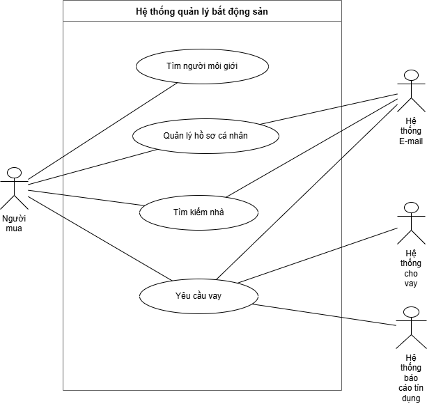

# Week 8 — Use Case Diagram

## Bài tập

Cho các tác nhân: Người mua, Hệ thống E-mail, Hệ thống cho vay và Hệ thống báo cáo tín dụng  
Cho các use case: Tìm người môi giới, Quản lý hồ sơ cá nhân, Tìm kiếm nhà và Yêu cầu vay  
Hãy vẽ biểu đồ use case tương ứng.

## Diagram

## Mô tả

### Actors
- **Người mua** — tác nhân chính, tương tác với toàn bộ use case
- **Hệ thống E-mail** — nhận thông báo từ Quản lý hồ sơ cá nhân, Tìm kiếm nhà, Yêu cầu vay
- **Hệ thống cho vay** — xử lý Yêu cầu vay
- **Hệ thống báo cáo tín dụng** — kiểm tra tín dụng khi có Yêu cầu vay

### Use Cases
| Use Case | Actor liên quan |
|---|---|
| Tìm người môi giới | Người mua |
| Quản lý hồ sơ cá nhân | Người mua, Hệ thống E-mail |
| Tìm kiếm nhà | Người mua, Hệ thống E-mail |
| Yêu cầu vay | Người mua, Hệ thống E-mail, Hệ thống cho vay, Hệ thống báo cáo tín dụng |

### Các mối liên kết
- Người mua → Tìm người môi giới
- Người mua → Quản lý hồ sơ cá nhân
- Người mua → Tìm kiếm nhà
- Người mua → Yêu cầu vay
- Quản lý hồ sơ cá nhân → Hệ thống E-mail
- Tìm kiếm nhà → Hệ thống E-mail
- Yêu cầu vay → Hệ thống E-mail
- Yêu cầu vay → Hệ thống cho vay
- Yêu cầu vay → Hệ thống báo cáo tín dụng

## Tool sử dụng

[Draw.io](https://app.diagrams.net) — file nguồn: `diagrams/week8_usecase_diagram.drawio`
